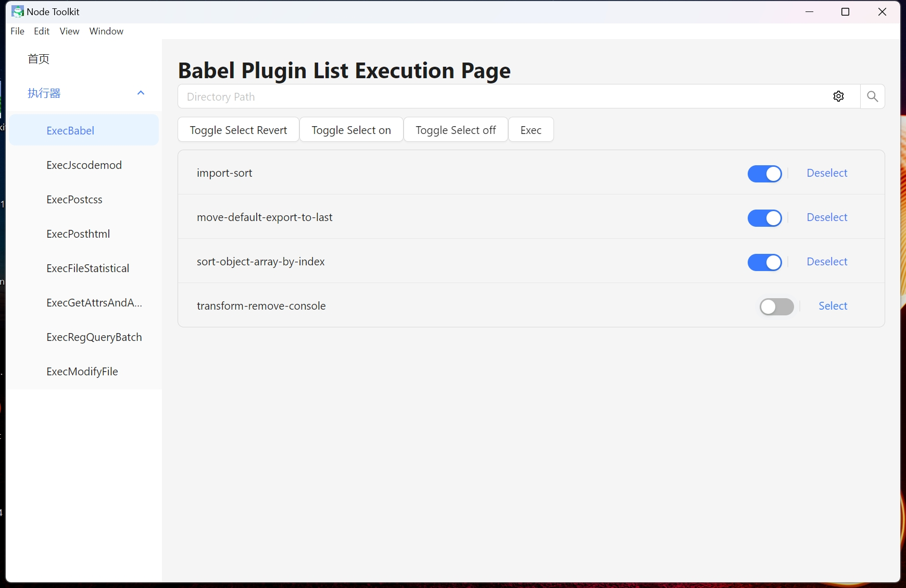
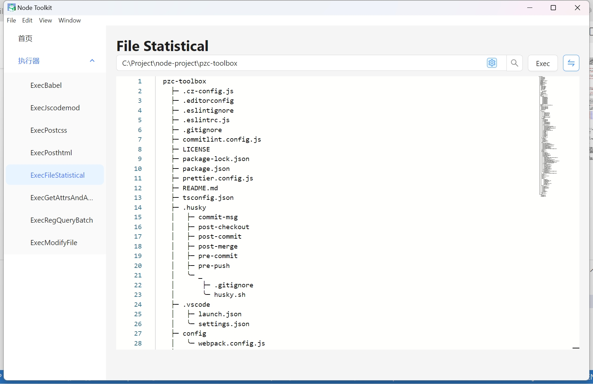

## **PZC 工具箱概览：**

工具箱是一个前端开发辅助工具集，它包含了以下组件：

1. **Babel 插件及其执行器：** 用于JavaScript代码转换的插件和执行工具。
2. **JSCodemod 插件及其执行器：** 用于自动化重构JavaScript代码的插件和执行工具。
3. **PostHTML 插件及其执行器：** 用于HTML文档处理和转换的插件和执行工具。
4. **PostCSS 插件及其执行器：** 用于CSS样式表转换和优化的插件和执行工具。
5. **项目注释提取与文档生成：** 自动从代码注释中提取信息并生成文档。
6. **文件夹信息统计与分类：** 对文件夹内容进行统计和分类。
7. **文件内容的正则匹配查询：** 使用正则表达式进行文件内容的搜索汇总。
8. **文件批量重命名：** 提供文件批量重命名操作功能。

**持续更新中...**

## **原理：**

**抽象语法树转换编译原理**：[AST 转换编译原理](https://github.com/jamiebuilds/the-super-tiny-compiler) 提供了编译原理的基础知识。

**语法树格式化工具**：[AST Explorer](https://astexplorer.net/) 是一个在线工具，用于格式化和探索抽象语法树。

**插件编写指南Babel 插件手册**：[Babel 插件编写手册](https://github.com/jamiebuilds/babel-handbook) 提供了编写Babel插件的详细指导。

## **插件模板资源：**

- **JSCodemod 模板**：[JSCodemod 模板来源](https://github.com/cpojer/js-codemod) 提供了JS代码现代化的模板。

- **Vue Codemod 模板**：[Vue Codemod 模板来源](https://github.com/vuejs/vue-codemod) 提供了Vue框架代码现代化的模板。

- **React Codemod 模板**：[React Codemod 模板来源](https://github.com/reactjs/react-codemod) 提供了React框架代码现代化的模板。

## 使用方式：

**安装依赖**：

git clone

npm i 

**命令行方式：**

1. **修改执行脚本：** 请手动编辑 `src/exec/xxx.ts` 文件，将 `new Exec('your dir')` 中的 `'your dir'` 替换为您的目录路径。
2. **添加插件注释：** 在相应的 TypeScript 文件中，通过注释的方式引入您需要的插件。
3. **执行插件：** 打开命令行工具，使用 `ts-node src/exec/xxx.ts` 命令来运行您的插件。

**图形用户界面方式：**

1. **启动开发服务器：** 在命令行中运行 `npm run dev` 命令，启动您的开发环境。

2. **启动Electron应用：** 接着，执行 `npm run dev-electron` 命令，以图形界面模式运行您的应用。

3. **选择目录和执行插件：** 在Electron界面中，选择您希望操作的目录和插件，然后执行它们。

## **操作界面待完善:**







## 目录结构(部分)说明
```
├─ src
    ├─ assets
    |   ├─ icons
    |   |   ├─ close-icon
    |   |   ├─ max-icon
    |   |   ├─ min-icon
    |   |   ├─ restore-icon
    |   |   ╰─ index.ts // 索引文件，用于导出所有图标
    |   ├─ images
    |   |   ├─ electron-img
    |   |   ├─ logo
    |   |   ╰─ index.ts // 索引文件，用于导出所有图片资源
    |   ╰─ index.ts // 索引文件，用于导出所有资源
    ├─ components
    |   ├─ app
    |   |   ╰─ index.vue // 应用入口组件
    |   ├─ desktop-header
    |   |   ╰─ index.vue // 桌面头部组件
    |   ├─ exception
    |   |   ├─ exception401.vue
    |   |   ├─ exception403.vue
    |   |   ├─ exception404.vue
    |   |   ├─ exception500.vue
    |   |   ╰─ index.ts // 异常页面索引
    |   ├─ exec
    |   |   ├─ exec-babel.vue // Babel执行组件
    |   |   ├─ exec-file-statistical.vue // 文件统计组件
    |   |   ╰─ ...
    |   ├─ home-page
    |   |   ╰─ index.vue // 首页组件
    |   ╰─ ...
    ├─ desktop
    |   ├─ handle // **桌面交互处理**
    |   ├─ index // 桌面入口
    |   ├─ listen // 监听事件
    |   ├─ main-window // 主窗口管理
    |   ╰─ system-tray // 系统托盘
    ├─ exec
    |   ├─ exec-babel-plugin.ts // Babel插件执行逻辑
    |   ├─ exec-file-statistical.ts // 文件统计逻辑
    |   ├─ exec-get-attrs-and-annotation.ts // 获取属性和注解逻辑
    |   ├─ exec-jscodemod.ts // JS代码修改逻辑
    |   ├─ exec-modify-file-names-batch.ts // 批量修改文件名逻辑
    |   ├─ exec-postcss-plugin.ts // PostCSS插件执行逻辑
    |   ├─ exec-posthtml-plugin.ts // PostHTML插件执行逻辑
    |   ├─ exec-reg-query-batch.ts // 正则批量查询逻辑
    |   ├─ exec-transfer-file-name-To-kebab-case.ts // 文件名转换逻辑
    |   ╰─ index.ts // 执行逻辑索引
    ├─ layout
    |   ╰─ index.vue // 布局组件
    ├─ plugins
    |   ├─ ast-utils.js // AST工具方法
    |   ├─ sfc-utils.js // SFC工具方法
    |   ├─ use-babel-plugin.js // Babel插件使用包装
    |   ├─ use-codemod.js // Codemod使用包装
    |   ├─ use-postcss-plugin.js // PostCSS插件使用包装
    |   ├─ use-posthtml-plugin.js // PostHTML插件使用包装
    |   ╰─ ...
    ├─ query
    |   ├─ js // JavaScript查询
    |   ├─ json // JSON查询
    |   ├─ md // Markdown查询
    |   ╰─ sfc // SFC查询
    ├─ routers
    |   ╰─ index.js // 路由配置
    ├─ slices // 状态管理切片
    ├─ store // 状态管理
    ├─ style // 样式目录
    ├─ test // 测试目录
    ├─ utils // 工具函数
    ├─ web // Web特定逻辑
    ╰─ index.js // 入口文件
╰─ package.json // 项目配置文件
```
