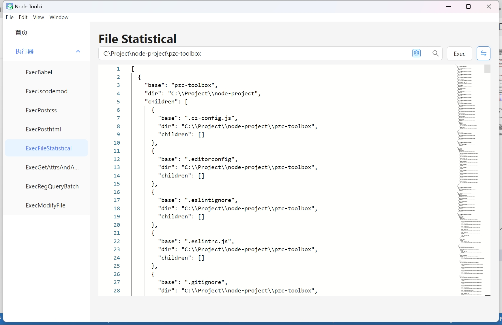

## **PZC 工具箱概览：**

工具箱是一个前端开发辅助工具集，它包含了以下组件：

1. **Babel 插件及其执行器：** 用于JavaScript代码转换的插件和执行工具。
2. **JSCodemod 插件及其执行器：** 用于自动化重构JavaScript代码的插件和执行工具。
3. **PostHTML 插件及其执行器：** 用于HTML文档处理和转换的插件和执行工具。
4. **PostCSS 插件及其执行器：** 用于CSS样式表转换和优化的插件和执行工具。
5. **项目注释提取与文档生成：** 自动从代码注释中提取信息并生成文档。
6. **文件夹信息统计与分类：** 对文件夹内容进行统计和分类。
7. **文件内容的正则匹配查询：** 使用正则表达式进行文件内容的搜索汇总。
8. **文件批量重命名：** 提供文件批量重命名操作功能。

**持续更新中...**

## **原理：**

**抽象语法树转换编译原理**：[AST 转换编译原理](https://github.com/jamiebuilds/the-super-tiny-compiler) 提供了编译原理的基础知识。

**语法树格式化工具**：[AST Explorer](https://astexplorer.net/) 是一个在线工具，用于格式化和探索抽象语法树。

**插件编写指南Babel 插件手册**：[Babel 插件编写手册](https://github.com/jamiebuilds/babel-handbook) 提供了编写Babel插件的详细指导。

## **插件模板资源：**

- **JSCodemod 模板**：[JSCodemod 模板来源](https://github.com/cpojer/js-codemod) 提供了JS代码现代化的模板。

- **Vue Codemod 模板**：[Vue Codemod 模板来源](https://github.com/vuejs/vue-codemod) 提供了Vue框架代码现代化的模板。

- **React Codemod 模板**：[React Codemod 模板来源](https://github.com/reactjs/react-codemod) 提供了React框架代码现代化的模板。

## 使用方式：

**安装依赖**：

git clone

npm i 

**命令行方式：**

1. **修改执行脚本：** 请手动编辑 `src/exec/xxx.ts` 文件，将 `new Exec('your dir')` 中的 `'your dir'` 替换为您的目录路径。
2. **添加插件注释：** 在相应的 TypeScript 文件中，通过注释的方式引入您需要的插件。
3. **执行插件：** 打开命令行工具，使用 `ts-node src/exec/xxx.ts` 命令来运行您的插件。

**图形用户界面方式：**

1. **启动开发服务器：** 在命令行中运行 `npm run dev` 命令，启动您的开发环境。

2. **启动Electron应用：** 接着，执行 `npm run dev-electron` 命令，以图形界面模式运行您的应用。

3. **选择目录和执行插件：** 在Electron界面中，选择您希望操作的目录和插件，然后执行它们。

## **操作界面待完善:**




## 目录结构(部分)说明
```
pzc-toolbox                                             //
├─ src                                                  //
│  ├─ exec                                              //执行器集合
│  │  ├─ classify-files-group.ts                        //文件信息统计
│  │  ├─ exec-bable-plugin.ts                           //执行babel插件
│  │  ├─ exec-get-attrs-and-annotation.ts               //获取项目注释
│  │  ├─ exec-jscodemod.ts                              //执行jscodemode
│  │  ├─ exec-postcss-plugin.ts                         //执行postcss
│  │  ├─ exec-posthtml-plugin.ts                        //posthtml
│  │  ├─ exec-reg-query.ts                              //执行正则指定内容查询
│  │  ├─ exec-reg-query-batch.ts                        //执行正则批量查询
│  │  ├─ exec-transfer-file-name-To-kebab-case.ts       //文件名驼峰转化
│  │  └─ index.ts                                       //方法集合
│  ├─ plugins                                           //插件集合
│  │  ├─ babel-plugins                                  //babel插件
│  │  │  ├─ ast-utils.ts                                //babel工具方法集合
│  │  │  ├─ depart-default-export-object-express.ts     //重置导出
│  │  │  ├─ depart-switch.ts                            //分离switch
│  │  │  ├─ extract-annotation.ts                       //提取注释
│  │  │  ├─ import-sort.ts                              //导入排序
│  │  │  ├─ move-default-export-to-last.ts              //移动默认导出
│  │  │  ├─ remove-invalid-comment.ts                   //移除包含this的无效注释
│  │  │  ├─ replace-memberExpress-object-or-property.ts //替换表达式的调用对象或者调用属性
│  │  │  ├─ sort-object-array-by-index.ts               //对象数组按index排序
│  │  │  ├─ transfer-file-name-tok-kebab-case.ts        //引用驼峰转化
│  │  │  └─ transform-remove-console.ts                 //移除打印
│  │  ├─ jscodemods                                     //codemode集合
│  │  │  ├─ arrow-function-arguments.ts                 //简化箭头参数
│  │  │  ├─ arrow-function.ts                           //转化箭头函数
│  │  │  ├─ no-reassign-params.ts                       //不使用函数参数同一命名
│  │  │  ├─ no-vars.ts                                  //移除全局定义
│  │  │  ├─ object-shorthand.ts                         //简化对象属性
│  │  │  ├─ rm-object-assign.ts                         //移除对象注册
│  │  │  ├─ rm-requires.ts                              //移除无效请求
│  │  │  ├─ template-literals.ts                        //转化模板字符串
│  │  │  └─ unchain-variables.ts                        //断开链式定义
│  │  ├─ postcss-plugins                                //postcss插件集合
│  │  │  └─ transfer-file-name-tok-kebab-case.ts        //引用驼峰转化
│  │  ├─ posthtml-plugins                               //posthtml插件集合
│  │  │  ├─ property-sort.ts                            //属性排序
│  │  │  ├─ query-tag.ts                                //查询标签
│  │  │  └─ transfer-file-name-tok-kebab-case.ts        //引用驼峰转化
│  │  ├─ sfc-utils.ts                                   //@vue/compiler-sfc封装方法集合
│  │  ├─ use-babel-plugin.ts                            //Babel插件使用包装
│  │  ├─ use-codemod.ts                                 //codemod使用包装
│  │  ├─ use-postcss-plugin.ts                          //postcss使用包装
│  │  ├─ use-posthtml-plugin.ts                         //posthtml使用包装
│  ├─ query                                             //查询结果和文件输出
│  └─ utils                  ****                           //查询结果
│     ├─ cli-progress.ts                                //进度条
│     ├─ common.ts                                      //通用方法
│     ├─ fs.ts                       ****               //文件系统相关
│     ├─ md.ts                                          //文档相关
└─ tsconfig.json                                        //ts配置
```
