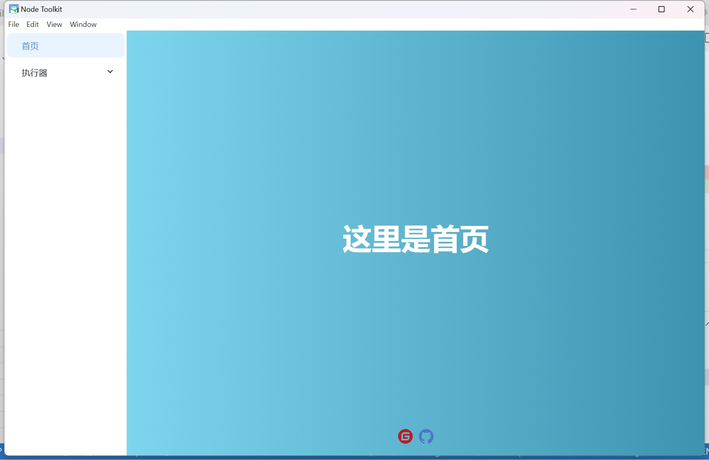
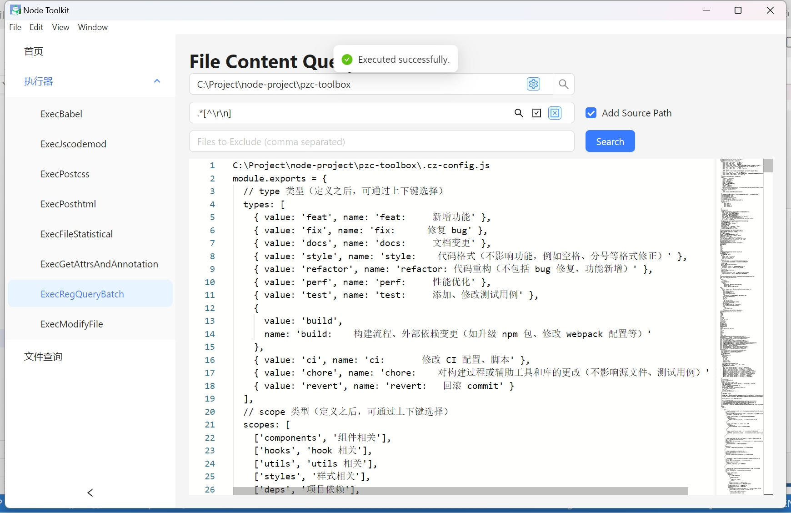
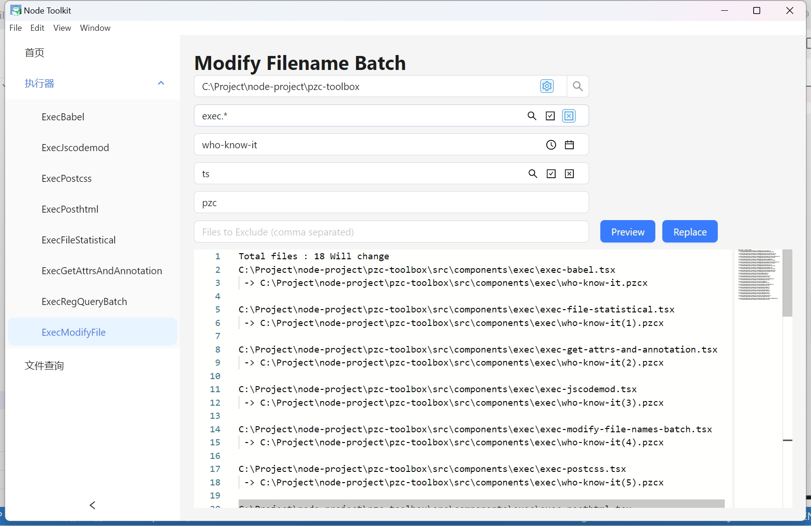

## **node 工具箱概览：**

工具箱是一个前端开发辅助工具集，它包含了以下组件：

1. **Babel 插件及其执行器：** 用于JavaScript代码转换的插件和执行工具。
2. **JSCodemod 插件及其执行器：** 用于自动化重构JavaScript代码的插件和执行工具。
3. **PostHTML 插件及其执行器：** 用于HTML文档处理和转换的插件和执行工具。
4. **PostCSS 插件及其执行器：** 用于CSS样式表转换和优化的插件和执行工具。
5. **项目注释提取与文档生成：** 从代码注释中提取信息并生成文档。（仅限前端项目）
6. **文件夹信息统计与分类：** 对文件夹进行统计和分类，生成项目目录结构和目录结构信息。（统计和分类功能实现了没做操作界面）
7. **文件内容的正则匹配查询：** 使用正则表达式进行文件内容的搜索汇总。（替换推荐直接使用编辑器搜索功能自带历史记录）
8. **文件批量重命名：** 提供文件批量重命名操作功能。
9. **文件信息查询：** 提供文件查询功能。（node性能受限，不能直接获取硬盘MTF表和日志，只能通过遍历文件夹的方式获取）
**持续更新中...**

## **原理：**

**抽象语法树转换编译原理**：[AST 转换编译原理](https://github.com/jamiebuilds/the-super-tiny-compiler) 提供了编译原理的基础知识。

**语法树格式化工具**：[AST Explorer](https://astexplorer.net/) 是一个在线工具，用于格式化和探索抽象语法树。

**插件编写指南Babel 插件手册**：[Babel 插件编写手册](https://github.com/jamiebuilds/babel-handbook) 提供了编写Babel插件的详细指导。

## **插件模板资源：**

- **JSCodemod 模板**：[JSCodemod 模板来源](https://github.com/cpojer/js-codemod) 提供了JS代码现代化的模板。

- **Vue Codemod 模板**：[Vue Codemod 模板来源](https://github.com/vuejs/vue-codemod) 提供了Vue框架代码现代化的模板。

- **React Codemod 模板**：[React Codemod 模板来源](https://github.com/reactjs/react-codemod) 提供了React框架代码现代化的模板。

## 使用方式：

**安装依赖**：

git clone

npm i 

**命令行方式：**

1. **修改执行脚本：** 请手动编辑 `src/exec/xxx.ts` 文件，将 `new Exec('your dir')` 中的 `'your dir'` 替换为您的目录路径。
2. **添加插件注释：** 在相应的 TypeScript 文件中，通过注释的方式引入您需要的插件。
3. **执行插件：** 打开命令行工具，使用 `ts-node src/exec/xxx.ts` 命令来运行您的插件。

**图形用户界面方式：**

1. **启动开发服务器：** 在命令行中运行 `npm run dev` 命令，启动您的开发环境。

2. **启动Electron应用：** 接着，执行 `npm run dev-electron` 命令，以图形界面模式运行您的应用。

3. **选择目录和执行插件：** 在Electron界面中，选择您希望操作的目录和插件，然后执行它们。

**应用安装方式**

  下载release，自己动手打包。产出文件大于100M，直接发布要收费，穷啊。

1. **打开命令行工具**：
   首先，你需要打开命令行工具，比如Windows的CMD或者PowerShell（管理员）。

2. **定位到项目目录**：
   使用`cd`命令切换到包含项目文件的目录。

3. **构建项目**：
   在项目目录中，运行以下命令来构建你的项目：`npm run build`

4. **构建Electron应用**：
   如果你需要为Windows 64位系统构建Electron应用，运行：
   `npm run build-electron-win64`
   如果需要为macOS 64位系统构建Electron应用，运行：
   `npm run build-electron-mac64`

   macOS 应用需要进行代码签名才能被信任打开。这需要 Apple 开发者账号，通过 Xcode 或 electron-builder 进行签名。签名过程包括生成 CSR（Certificate Signing Request），下载并安装 Developer ID 证书，导出为 .p12 文件，并配置环境变量。
   自 macOS 10.15 起，应用程序除了签名外还需要进行公证。这可以通过 electron-notarize 插件来实现，确保应用程序符合 Apple 的安全标准。
   从 macOS 10.15 Catalina 开始，Apple 引入了更严格的权限和隐私保护措施，应用程序需要在 Info.plist 中声明对特定功能的访问请求，并且在运行时提供用户可接受的描述。
   在 Info.plist 文件中添加权限请求时，需要确保添加正确的键和描述，以便系统能够正确地提示用户授权。例如：
   ```xml
   <key>NSAppleEventsUsageDescription</key>
   <string>This app requires access to send Apple events to other apps.</string>
   ```

5. **找到安装文件**：
   构建完成后，你需要在`dist`目录下的`win`子目录中找到生成的`.exe`安装文件。根据你提供的指令，文件名可能是`node-toolkit-2.1.0-win-x64.exe`。
   在macOS上，你需要在`dist`目录下的`mac`子目录中找到生成的`.dmg`安装文件。

6. **安装应用程序**：
   双击`.exe`文件，按照安装向导的指示完成安装过程。
   在macOS上，双击`.dmg`文件，并按照安装向导的指示完成安装过程。

请注意，这些步骤假设你已经安装了Node.js和npm，并且你的项目已经配置了相应的构建脚本。如果你遇到任何问题，可能需要检查你的项目配置或查看项目的文档以获取更详细的安装指南。

## **操作界面待完善:**









## 目录结构(部分)说明
```
  src
  ├─ assets // 存放资源文件
    │   ├─ icons // 图标资源
    │   │   ├─ close-icon.svg
    │   │   ├─ gitee-icon.svg
    │   │   ├─ github-icon.svg
    │   │   ├─ max-icon.svg
    │   │   ├─ min-icon.svg
    │   │   ╰─ restore-icon.svg
    │   ╰─ images // 图片资源
    │       ╰─ electron-img.png
    ├─ components // **组件目录**
    │   ├─ antd-wrap // 封装antd组件
    │   │   ├─ loading // 加载组件
    │   │   │   ╰─ index.jsx
    │   │   ├─ menus // 菜单组件
    │   │   │   ├─ index.tsx
    │   │   │   ╰─ use-context-menu.tsx
    │   │   ├─ progress-bar // 进度条组件
    │   │   │   ├─ index.tsx
    │   │   │   ╰─ use-progress.ts
    │   │   ╰─ search // 搜索组件
    │   │       ╰─ reg-exp-input.tsx
    │   ├─ app // 应用组件
    │   │   ╰─ index.tsx
    │   ├─ common // 通用组件
    │   │   ╰─ loading.tsx
    │   ├─ desktop-header // 桌面头部组件
    │   │   ╰─ index.tsx
    │   ├─ exception // 异常处理组件
    │   │   ├─ exception401.jsx
    │   │   ├─ exception403.jsx
    │   │   ├─ exception404.jsx
    │   │   ╰─ exception500.jsx
    │   ├─ exec // 执行脚本组件
    │   │   ├─ exec-babel.tsx
    │   │   ├─ exec-file-statistical.tsx
    │   │   ├─ exec-get-attrs-and-annotation.tsx
    │   │   ├─ exec-jscodemod.tsx
    │   │   ├─ exec-modify-file-names-batch.tsx
    │   │   ├─ exec-postcss.tsx
    │   │   ├─ exec-posthtml.tsx
    │   │   ╰─ exec-reg-query-batch.tsx
    │   ├─ file-manage // 文件管理组件
    │   │   ├─ context.ts
    │   │   ├─ directory.tsx
    │   │   ├─ index.tsx
    │   │   ├─ search.tsx
    │   │   ├─ config // 配置相关
    │   │   │   ├─ menus.tsx
    │   │   │   ├─ options.ts
    │   │   │   ╰─ table-column.tsx
    │   │   ╰─ views // 视图相关
    │   │       ├─ icon-view.tsx
    │   │       ├─ preview.tsx
    │   │       ╰─ table-view.tsx
    │   ├─ home-page // 首页组件
    │   │   ╰─ index.tsx
    │   ├─ no-match // 无匹配页面组件
    │   │   ╰─ index.jsx
    │   ╰─ svg-icon // SVG图标组件
    │       ╰─ index.tsx
    ├─ desktop // 桌面逻辑
    │   ├─ handle.ts
    │   ├─ index.ts
    │   ├─ listen.ts
    │   ├─ main-window.ts
    │   ├─ menus.ts
    │   ╰─ system-tray.ts
    ├─ exec // 执行逻辑
    │   ├─ exec-babel-plugin.ts
    │   ├─ exec-file-statistical.ts
    │   ├─ exec-get-attrs-and-annotation.ts
    │   ├─ exec-jscodemod.ts
    │   ├─ exec-modify-file-names-batch.ts
    │   ├─ exec-postcss-plugin.ts
    │   ├─ exec-posthtml-plugin.ts
    │   ├─ exec-reg-query-batch.ts
    │   ├─ exec-transfer-file-name-To-kebab-case.ts
    │   ╰─ index.ts
    ├─ file-manage // 文件管理逻辑
    │   ╰─ index.ts
    ├─ layout // 布局组件
    │   ╰─ index.tsx
    ├─ plugins // 插件目录
    │   ├─ ast-utils.ts
    │   ├─ sfc-utils.ts
    │   ├─ use-babel-plugin.ts
    │   ├─ use-codemod.ts
    │   ├─ use-postcss-plugin.ts
    │   ├─ use-posthtml-plugin.ts
    │   ├─ babel-plugins // Babel插件
    │   │   ├─ ast-utils.ts
    │   │   ├─ extract-annotation.ts
    │   │   ├─ import-sort.ts
    │   │   ├─ move-default-export-to-last.ts
    │   │   ├─ remove-invalid-comment.ts
    │   │   ├─ replace-memberExpress-object-or-property.ts
    │   │   ├─ sort-object-array-by-index.ts
    │   │   ├─ transfer-file-name-tok-kebab-case.ts
    │   │   ╰─ transform-remove-console.ts
    │   ├─ jscodemods // JS代码修改工具
    │   │   ├─ arrow-function.ts
    │   │   ├─ no-reassign-params.ts
    │   │   ├─ no-vars.ts
    │   │   ├─ object-shorthand.ts
    │   │   ├─ rm-object-assign.ts
    │   │   ├─ rm-requires.ts
    │   │   ├─ template-literals.ts
    │   │   ╰─ unchain-variables.ts
    │   ├─ postcss-plugins // PostCSS插件
    │   │   ├─ property-sort.ts
    │   │   ╰─ transfer-file-name-tok-kebab-case.ts
    │   ╰─ posthtml-plugins // PostHTML插件
    │       ├─ property-sort.ts
    │       ╰─ transfer-file-name-tok-kebab-case.ts
    ├─ routers // 路由配置
    │   ╰─ index.tsx
    ├─ slices // 状态切片
    │   ╰─ directory-slice.ts
    ├─ store // 状态管理
    │   ├─ index.ts
    │   ╰─ use-directory.ts
    ├─ style // 样式目录
    │   ╰─ less // 使用LESS作为CSS预处理器
    │       ├─ app.less
    │       ├─ common.less
    │       ├─ desktop-header.less
    │       ├─ file-manage.less
    │       ├─ home-page.less
    │       ├─ icon.less
    │       ├─ layout.less
    │       ├─ loading.less
    │       ├─ markdown-styles.less
    │       ├─ menu.less
    │       ╰─ variables.less
    ├─ types // 类型定义
    │   ├─ common.d.ts
    │   ├─ custom.d.ts
    │   ├─ file.d.ts
    │   ╰─ webpack.d.ts
    ├─ utils // 工具函数
    │   ├─ cli-progress.ts
    │   ├─ common.ts
    │   ├─ context-bridge.ts
    │   ├─ desktop-utils.ts
    │   ├─ fs.ts
    │   ├─ ignore.ts
    │   ├─ log.ts
    │   ├─ md.ts
    │   ├─ random.ts
    │   ├─ svg-icons.ts
    │   ╰─ time.ts
    ╰─ web // Web相关
    ├─ index.tsx
    ╰─ listen.ts
```
