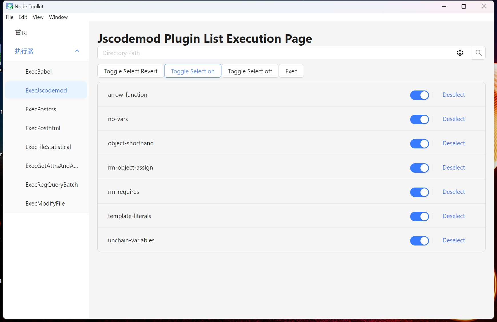

## pzc 的工具箱

#### 介绍

pzc 的工具箱，包含：

1. babel 插件以及执行器
2. jscodemod 插件以及执行器
3. posthtml 插件以及执行器
4. postcss 插件以及执行器
5. 项目注释提取和文档生成
6. 文件夹信息统计和分类
7. 文件内容正则匹配、替换和去重
8. 文件批量重命名和复制粘贴移动

未完待续...

#### 收集的插件模板:

[ast 转化编译原理](https://github.com/jamiebuilds/the-super-tiny-compiler)

[astexplorer 语法树格式化网站](https://astexplorer.net/)

[babel 插件编写手册](https://github.com/jamiebuilds/babel-handbook)

[js-codemod 模板来源](https://github.com/cpojer/js-codemod)

[vue-codemod 模板来源](https://github.com/vuejs/vue-codemod)

[react-codemod 模板来源](https://github.com/reactjs/react-codemod)

#### 使用
npm i 安装依赖

- cmd方式
  - 自行修改src/exec/xxx.ts下的new Exec('your dir')
  - 通过注释添加插件
  - ts-node src/exec/xxx.ts，执行插件

- 控制界面方式
  - npm run dev
  - npm run dev-electron
  - 选择目录和插件执行

操作界面待完善



#### 目录结构部分说明
```
pzc-toolbox                                             //
├─ src                                                  //
│  ├─ exec                                              //执行器集合
│  │  ├─ classify-files-group.ts                        //文件信息统计
│  │  ├─ exec-bable-plugin.ts                           //执行babel插件
│  │  ├─ exec-get-attrs-and-annotation.ts               //获取项目注释
│  │  ├─ exec-jscodemod.ts                              //执行jscodemode
│  │  ├─ exec-postcss-plugin.ts                         //执行postcss
│  │  ├─ exec-posthtml-plugin.ts                        //posthtml
│  │  ├─ exec-reg-query.ts                              //执行正则指定内容查询
│  │  ├─ exec-reg-query-batch.ts                        //执行正则批量查询
│  │  ├─ exec-transfer-file-name-To-kebab-case.ts       //文件名驼峰转化
│  │  └─ index.ts                                       //方法集合
│  ├─ plugins                                           //插件集合
│  │  ├─ babel-plugins                                  //babel插件
│  │  │  ├─ ast-utils.ts                                //babel工具方法集合
│  │  │  ├─ depart-default-export-object-express.ts     //重置导出
│  │  │  ├─ depart-switch.ts                            //分离switch
│  │  │  ├─ extract-annotation.ts                       //提取注释
│  │  │  ├─ import-sort.ts                              //导入排序
│  │  │  ├─ move-default-export-to-last.ts              //移动默认导出
│  │  │  ├─ remove-invalid-comment.ts                   //移除包含this的无效注释
│  │  │  ├─ replace-memberExpress-object-or-property.ts //替换表达式的调用对象或者调用属性
│  │  │  ├─ sort-object-array-by-index.ts               //对象数组按index排序
│  │  │  ├─ transfer-file-name-tok-kebab-case.ts        //驼峰转化
│  │  │  └─ transform-remove-console.ts                 //移除打印
│  │  ├─ jscodemods                                     //codemode集合
│  │  │  ├─ arrow-function-arguments.ts                 //简化箭头参数
│  │  │  ├─ arrow-function.ts                           //转化箭头函数
│  │  │  ├─ no-reassign-params.ts                       //不使用函数参数同一命名
│  │  │  ├─ no-vars.ts                                  //移除全局定义
│  │  │  ├─ object-shorthand.ts                         //简化对象属性
│  │  │  ├─ rm-object-assign.ts                         //移除对象注册
│  │  │  ├─ rm-requires.ts                              //移除无效请求
│  │  │  ├─ template-literals.ts                        //转化模板字符串
│  │  │  └─ unchain-variables.ts                        //断开链式定义
│  │  ├─ postcss-plugins                                //postcss插件集合
│  │  │  └─ transfer-file-name-tok-kebab-case.ts        //驼峰转化
│  │  ├─ posthtml-plugins                               //posthtml插件集合
│  │  │  ├─ property-sort.ts                            //属性排序
│  │  │  ├─ query-tag.ts                                //查询标签
│  │  │  └─ transfer-file-name-tok-kebab-case.ts        //驼峰转化
│  │  ├─ sfc-utils.ts                                   //@vue/compiler-sfc封装方法集合
│  │  ├─ use-babel-plugin.ts                            //Babel插件使用包装
│  │  ├─ use-codemod.ts                                 //codemod使用包装
│  │  ├─ use-postcss-plugin.ts                          //postcss使用包装
│  │  ├─ use-posthtml-plugin.ts                         //posthtml使用包装
│  ├─ query                                             //查询结果和文件输出
│  └─ utils                                             //查询结果
│     ├─ cli-progress.ts                                //进度条
│     ├─ common.ts                                      //通用方法
│     ├─ fs.ts                       ****               //文件系统相关
│     ├─ md.ts                                          //文档相关
└─ tsconfig.json                                        //ts配置
```
